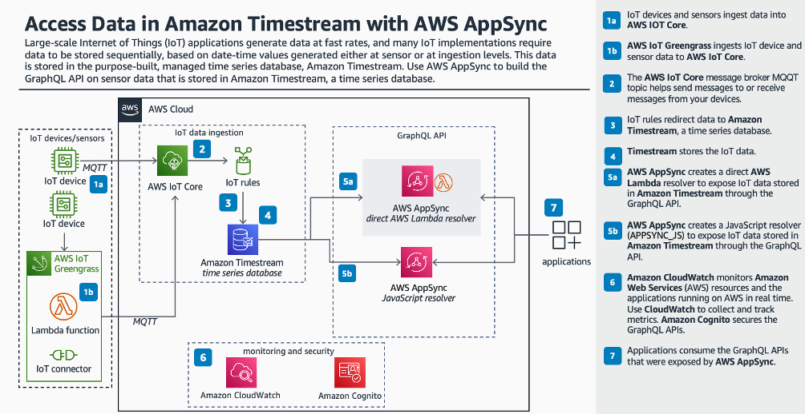

<h1 align="center">
Access data in Amazon Timestream with AWS AppSync
 
   
   
</h1>

This blog post looks at how to build [GraphQL API](https://graphql.org/) using [AWS AppSync](https://docs.aws.amazon.com/appsync/latest/devguide/what-is-appsync.html) to access [Amazon Timestream](https://aws.amazon.com/timestream/)

### Architecture

Target architecture:

  

### Usage

#### Prerequisites
To deploy the solution,

1. [An AWS Account](https://signin.aws.amazon.com/signin?redirect_uri=https%3A%2F%2Fportal.aws.amazon.com%2Fbilling%2Fsignup%2Fresume&client_id=signup)
3. [The AWS Command Line Interface (AWS CLI)](https://docs.aws.amazon.com/cli/latest/userguide/getting-started-install.html)
3. [Find timestream cell api endpooint](https://docs.aws.amazon.com/timestream/latest/developerguide/Using-API.endpoint-discovery.describe-endpoints.implementation.html)
* For example

`
REGION_ENDPOINT="https://query.timestream.us-east-1.amazonaws.com"
REGION=us-east-1
aws timestream-write describe-endpoints \
--endpoint-url $REGION_ENDPOINT \
--region $REGION
`

Verify the cell number in the Address. In the below example, note down cell2 as parameter value and supply in `Deploy the example section step 2`.

***For example:***

query-cell2.timestream.us-east-1.amazonaws.com

#### Deploy the example
> **Security Note**
1. This solution does not implement AWS Congnito authentication. In this example, AppSync API key is used to invoke AppSync endpoint.
2. Please verify suppressed security observations in cloud formation template

> **Note**
You are responsible for the cost of the AWS services used while running this sample deployment. There is no additional
cost for using this sample. For full details, see the pricing pages for each AWS service that you use in this sample. Prices are subject to change.

> **Note**
Due to this solution using Timestream, please ensure you choose a region to deploy this solution where Timestream is available.

1. Clone the repository to your local machine.
    * `git clone https://github.com/aws-samples/aws-appsync-access-amazon-timestream-example`

3. Deploy the solution
    * `aws cloudformation deploy --template-file cfn/template.yaml --stack-name appsync-timestream-api --parameter-overrides ParameterKey=TimestreamCellEndpoint,ParameterValue="<Update cell name from step 3>" --capabilities CAPABILITY_IAM CAPABILITY_AUTO_EXPAND`

4. Retrieve the details. Please note down the GraphQL endpoint and API key for testing purpose
    * `aws cloudformation describe-stacks --stack-name appsync-timestream-api --query "Stacks[0].Outputs" --output table`

## Test the example

You can test using AppSync Api console.

**AppSync Console**

1.	Navigate to AppSync console and select on the API name appsync-timestream-api  to view the dash-board for your API. 
2.	Next click on Queries in the left-hand menu to view the query editor. From here, we can test out the API by running the following queries:

  

3. Select query `getSensorDataUsingJsResolver(durationInMinutes: 10)` and choose the fields as shown in the screen below. Press the red colour arrow button to execute the query. You can see the result in JSON format on the right side.

  

4.	Next, select query `getSensorDataUsingJsResolver(durationInMinutes: 10)` and choose the fields as shown in screen below. Press the red colour arrow button to execute the query. You can see the result in JSON format on the right side.

  

### Clean up

In this blog post, we used a lambda function to simulate data at 2-minute interval. Hence, to avoid incur-ring future charges, clean up the resources created. To delete the stack, use the following command.

`
aws cloudformation delete-stack --stack-name appsync-timestream-api
`

### Conclusion

In this post, we learned how to create AppSync API to connect to the Timestream database and query the data. In doing do, we presented two code examples, one with APPSYNC_JS runtime and a lambda function. You can write your own code that implements your custom business logic by using AWS AppSync functions to access your data sources. This makes it easy for you to directly interact with data sources like Amazon DynamoDB, Aurora Serverless, OpenSearch Service, HTTP APIs, and other AWS services without having to deploy additional computational services or infrastructure. AWS AppSync also makes it easy to interact with an AWS Lambda function by configuring a Lambda data source. Lambda data sources allow you to run complex business logic using AWS Lambda’s full set capabilities to resolve a GraphQL request. In situations where you need to implement complex business logic that is not supported by the APPSYNC_JS runtime, you can use a Lambda data source as a proxy to interact with your target data source.

## Security
See [CONTRIBUTING](CONTRIBUTING.md#security-issue-notifications) for more information.

## License
This library is licensed under the MIT-0 License. See the LICENSE file.
